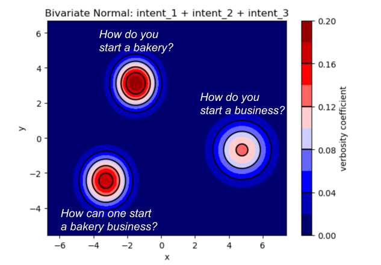
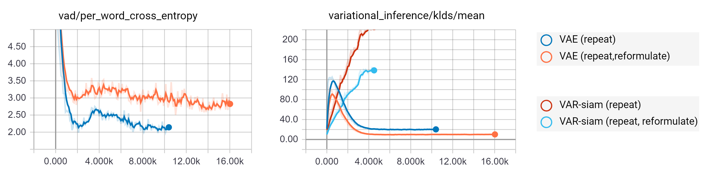
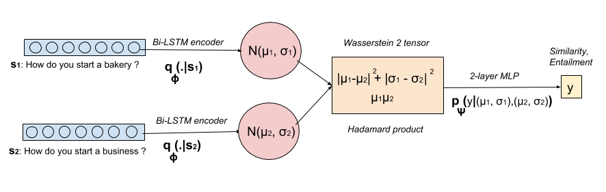
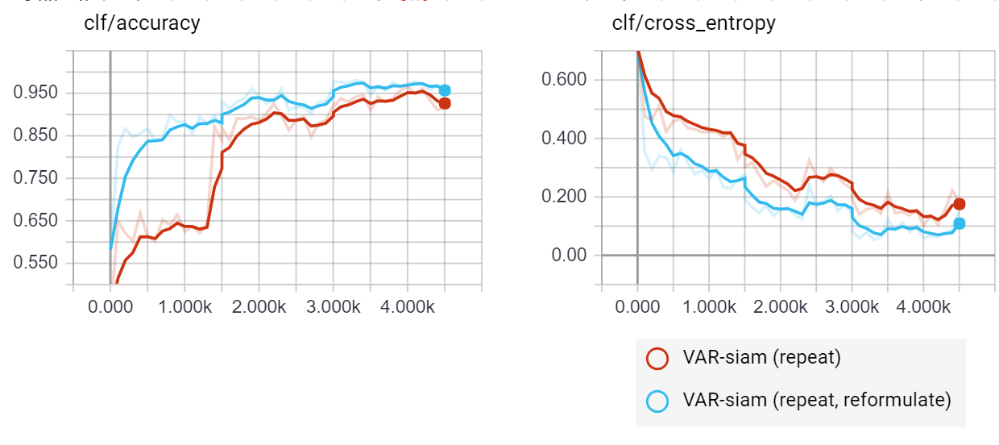
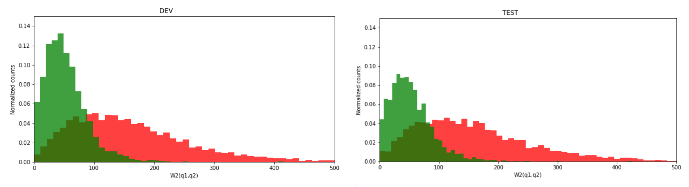

# variational-siamese-network

## Overview

Tensorflow implementation of [Learning semantic similarity in a continuous space](https://nips.cc/Conferences/2018/Schedule?type=Poster)
, Deudon M.



## Requirements

- [Python 3.5+](https://anaconda.org/anaconda/python)
- [TensorFlow 1.3.0+](https://www.tensorflow.org/install/)
- [Tqdm](https://pypi.python.org/pypi/tqdm)

## Usage

To train/test a variational siamese network, you need some data. 

The w2v folder holds pretrained models such as [GloVe](https://nlp.stanford.edu/projects/glove/) or [Word2Vec](https://github.com/mmihaltz/word2vec-GoogleNews-vectors). You can drag here any pretrained or custom model (We saved our weights and vocabulary in two files: embeddings_300d.p and vocab_300d.p).

In the data folder, you should put your data. We used quora_duplicate_questions.tsv. You should further put your train/dev/test files in the data/split folder (we saved those as .txt files). Your preprocessed data will be stored as .npy files in the folder named corpus.

- To train a variational siamese network with generative pretraining (repeat), consider running the following in the folder _deepNLU:
```
> python train.py VAE
```
- For the repeat, reformulate framework, consider running:
```
> python train.py VAD
```

The model will be saved in _deepNLU/save/.  <br/>
Our neural architecture is specified in nnet.py and utility functions in utils.py. <br/>
Our data loader and preprocessing is specified in data.py

- To visualize generative and discriminative training on tensorboard, run:
```
> tensorboard --logdir=summary
```

- To test a trained model, you can run eval.ipynb with the Jupyter Notebook.

## Architecture and Training

### Variational Auto Encoder (VAE)




### Variational Siamese Network





## Evaluation



## Acknowledgments

- [Ecole Polytechnique](http://www.polytechnique.edu/) for financial support <br/>
- [Télécom Paris-Tech](https://www.telecom-paristech.org/) for computational resources <br/>

Special thanks: <br/>
- Magdalena Fuentes for helping with Télécom's GPU and setting up the required environment. <br/>
- [Pr. Chloé Clavel](https://clavel.wp.imt.fr/), [Pr. Gabriel Peyré](http://www.gpeyre.com/), Constance Nozière and Paul Bertin for their critical reading of the paper.
- [Pr. Francis Bach](https://www.di.ens.fr/~fbach/) and [Pr. Guillaume Obozinski](http://imagine.enpc.fr/~obozinsg/), for their insightful course on probabilistic graphical models at ENS Cachan
- [Pr. Michalis Vazirgiannis](http://www.lix.polytechnique.fr/Labo/Michalis.Vazirgiannis/) for his course on Text Mining and NLP at Ecole Polytechnique. 
- We also thank the reviewers for their valuable comments and feedback.

## Author
Michel Deudon / [@mdeudon](https://github.com/MichelDeudon)
